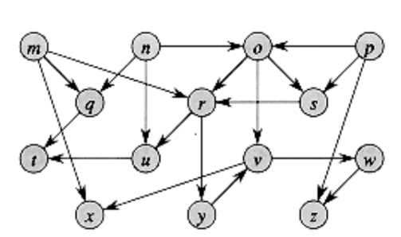

# Topological Sort

### Description
implement a Topological Sort algorithm and run it on the following graph shown in Figure 1.

  
**Figure 1.** Example directed graph as input data. 


### Outline
1. First, test whether the given Graph contains a cycle. 
   - If acyclic, perform a topological sort on that Graph. 
2. For your output, the vertices on a given **level** must be printed in alphabetical order.

You will apply this to the `topo.in` file that will be used as input for your program. The first couple of edges
are given.
- The first line in `topo.in` will be a single integer `v`. 
  - `v`: number of vertices to follow
- The next `v` lines will be the labels for the vertices in **alphabetical order**.
  - There will be one label for each newline. 
  - The labels are unique.
- The next line after the labels for vertices will be a single number `e`. 
  - `e`: number of edges to follow. 
  - There will be one edge per line.
  - Each edge will be of the form: `fromVertex` -> `toVertex`. 
- Assign a default weight of 1 to each edge.

### Input
``` 
14   # number of vertices to follow
m    # 14 unique vertex labels in alpha order
n
o
p
q
r
s
t
u
v
w
x
y
z
21   # number of edges to follow (assign weight=1 to all)
m q  # from -> to
m r
m x
n o
n q
n u
...
```

### Output
``` 
The Graph does not have a cycle.

List of vertices after topo sort.
['m', 'n', 'p', 'o', 'q', 's', 'r', 'u', 'y', 't', 'v', 'w', 'x', 'z']
```
