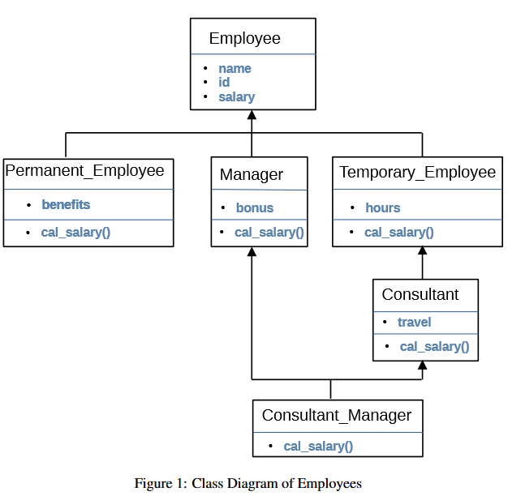
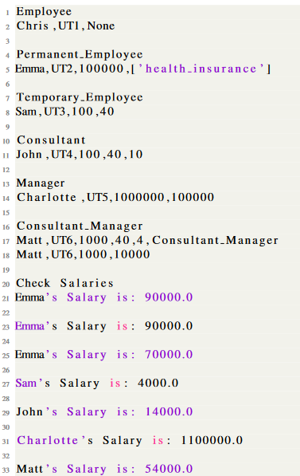

# Company Employees

### Description
A company has different types of employees and requires to manage the calculation of their salaries based
on different parameters. Figure 1 illustrates the different types of employees of this company which are the
following types: Employee, Permanent Employee, Temporary Employee, Consultant, Manager and
Consultant Manager.  

### Classes
- **Employee** has the following properties: `name`, `id` and `salary`.
- **Permanent Employee** is an `Employee`. 
  - A Permanent Employee has benefits that they can select from `health insurance`, `retirement`, or both [`retirement`, `health insurance`]. 
  - Implement a method called `cal_salary()` to calculate the actual salary based on selected benefits: 
    - if `benefits` = `health insurance` then `return salary ∗ 0.9`
    - if `benefits` = `retirement` then `return salary ∗ 0.8`
    - if `benefits` = [`retirement`, `health insurance`] is selected then `return salary ∗ 0.7`
- **Temporary Employee** has a property `hours` which is the working hours per month. 
  - The salary property represents the amount that a temporary employee is paid per hour. 
  - Implement a method called `cal_salary()` to calculate the actual salary by returning `salary ∗ hours`
- **Consultant** is a Temporary Employee and in addition has to travel. 
  - The property travel represents number of travel trips that a Consultant has to do and is additionally paid $1000
    for each travel. 
  - Implement a method called `cal_salary()` to calculate the actual salary similar to a Temporary Employee with 
  - an additional payment of `travel ∗ 1000`. 
  - (Tip: Try to reuse your code as much as possible to avoid having duplicated code)
- **Manager** is a special type of employee and is paid with a bonus payment in addition to their main salary. 
  - Manager has a property `bonus` which is added to their salary. 
  - Implement a method called `cal_salary()` to `return salary + bonus`
- **Consultant Manager** is a Consultant and is a Manager as well. 
- A Consultant Manager has `travel`, `hours` of work, and `bonus` payment. 
- Implement a method called `cal_salary()` to calculate the salary similar to a Temporary Employee and Consultant 
  with an additional bonus payment. 
  - The `cal_salary()` method should `return salary ∗ hours + travel ∗ 1000 + bonus`

### Implementation
- Each of your class constructors should use the following format `init (self, **kwargs)`
- Each of your classes should have a string method implementation 
  - (Define str (self) in each of your classes). 
  - You can design a string method to represent the objects in a string format. 

### Output:

