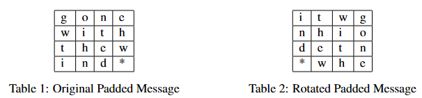
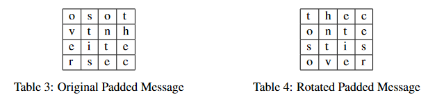

# Cipher (Simplified Cryptography)

### Description
Cryptography is an ancient study of secret writing. There is a wealth of literature in this field. An extremely
readable book on this subject is The Code Book by Simon Singh. This is a field of study that is of particular
relevance in Computer Science. Given the widespread use of computers, one of the things people are
interested in is making transactions over the internet more secure.

Here is a simple and clever way to encrypt plain text:
- Assume that the message contains only upper case letters, lower case letters and digits. 
- Let L be the length of the original message, and M the smallest square number greater than or equal to L. 
- Add (M-L) asterisks to the message, giving a padded message with length M. 
- Use the padded message to fill up a table of size K × K, where K^2 = M . 
- Fill the table in row-major order (left to right in each column, top to bottom for each row). 
- Now to encrypt, rotate the table 90° clockwise. 
- The encrypted message comes from reading the message in row-major order from the rotated table, omitting any asterisks and maintaining the case of each character
from the original message.  

Example encryption:
- Let us say the original message is `gonewiththewind`. 
- The message length L = 15 and so M = 16. 
- The padded message is `gonewiththewind*`. 
- Here are two tables showing the padded message and the padded message after rotation.



So the encrypted message (ignoring the asterisks) is `itwgnhiodetnwhe`. 

Decrypting a message would just be the reverse process of encrypting. 
Let us consider the encrypted message `osotvtnheitersec`.



So the decrypted message is `thecontestisover`.
___
### Input:
Read from standard input:
1. The first line is a string `P`, where `(1 ≤ length(P) ≤ 100)`, that you will have to encrypt according to the
following scheme. 
2. The second line is a string `Q`, where `(1 ≤ length(Q) ≤ 100)`, that you will have to decrypt. 
- Assume that both strings have only upper case letters, lower case letters, and digits. 
- Here is the format of your input `cipher.in`:
```
gonewiththewind
osotvtnheitersec
```

### Output:
Print your output to standard out:
1. The first line will be the encryption of string `P`.
2. The second line will be the decryption of the string `Q`.  

This is the format of your output `cipher.out`:
```
itwgnhiodetnwhe
thecontestisover
```
