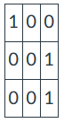
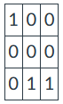

# Q3: Symmetric Matrices

Given a **square** **2-D list** of all 1s and 0s and dimension **N x N**:
- return True if the matrix is symmetric 
- False otherwise. 

### Description
- An N x N matrix is symmetric if it is equal to its transpose, which is the N x N matrix formed by swapping the row and column of each matrix element. 
- For example, if the original matrix is:   
  
  - Then the transpose would be:  
  


### Input
- The first line will contain the value N which is the dimension of the matrix.
- The following N lines will contain N space-separated values, each of which represents the values of the matrix.

**Example Input text file:**
```
3
1 0 0
0 0 1
0 0 0
```

**Example Output:**
```
False
```
